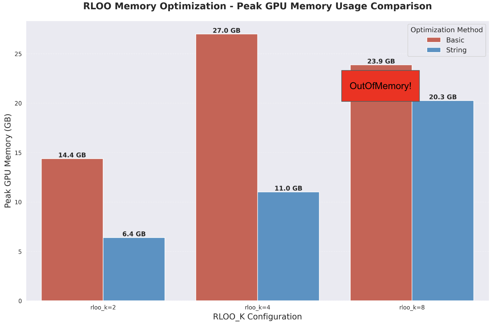
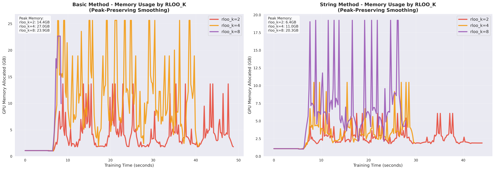
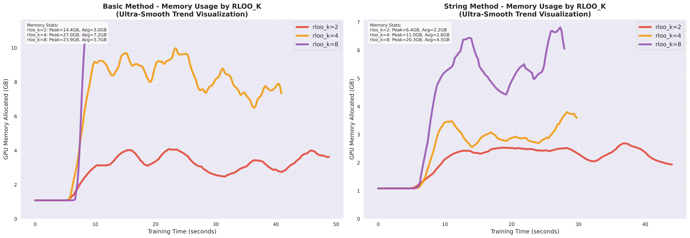

# TRL RLOO Memory Optimization Project

## Quick Start

The project demonstrates string-level processing optimization for TRL RLOO Trainer that reduces memory usage by 55% on average. To reproduce the results:

```bash
# 1. Setup environment
./setup_env.sh

# 2. Run baseline RLOO (original implementation)
./run_baseline-rloo.sh

# 3. Run optimized RLOO (string-level processing)
./run_improve-rloo.sh

# 4. Generate comparison charts
./visualize_results.sh
```

## System Requirements

**Tested Environment:**
- OS: Ubuntu 24.04.2 LTS
- GPU: NVIDIA GeForce RTX 5090 (32GB VRAM)
- PyTorch: 2.7.1+cu128
- Transformers: 4.54.1
- CUDA: 12.8

**Note for RTX 5090 users:** The setup_env.sh script installs PyTorch nightly with CUDA 12.8. For other GPUs, you may need to modify the PyTorch installation command in setup_env.sh to match your CUDA version.

## Test Configuration

**Model:** `trl-internal-testing/tiny-Qwen3ForCausalLM`

**Test Parameters:**
- rloo_k values: 2, 4, 8
- Sequence length: ~512 tokens
- Multiple runs for statistical validity

## Memory Optimization Results

The string-level processing approach shows significant memory improvements:

| Configuration | Baseline Memory | Optimized Memory | Reduction |
|---------------|----------------|------------------|-----------|
| rloo_k=2 | 14.38GB | 6.40GB | 55.5% |
| rloo_k=4 | 26.99GB | 11.01GB | 59.2% |
| rloo_k=8 | OOM  | 20.25GB | N/A |

Key finding: At rloo_k=8, the baseline implementation encounters OOM errors, while the optimized version completes successfully with 20.25GB peak memory usage.

## Visualization Results

### Peak Memory Comparison


### Memory Usage Patterns
<table>
<tr>
<td width="50%">


*Peak-preserving smoothing (accurate peak values)*

</td>
<td width="50%">


*Ultra-smooth visualization (peak values not accurate due to smoothing)*

</td>
</tr>
</table>

Note: The ultra-smooth visualization is designed for trend analysis. Peak memory values shown in the y-axis are not accurate due to smoothing algorithms.

## Implementation Details

The core optimization replaces inefficient token-level duplication:

```python
# Original implementation (inefficient)
queries = queries.repeat(args.rloo_k, 1)  # Memory usage × rloo_k

# Optimized implementation (efficient)
repeated_prompts = prompts_text * rloo_k
queries = processing_class(repeated_prompts, ...)["input_ids"]
```

This approach, inspired by OnlineDPO's string-level processing, avoids physical token duplication in GPU memory while maintaining identical functionality.

## Project Structure

```
├── trl/                      # Modified TRL submodule
├── experiments/              # Training scripts and configurations
│   ├── train.py             # Main training script
│   ├── config.py            # Experiment configuration
│   ├── memory_monitor.py    # Memory usage tracking
│   └── run_*_rloo*.sh       # Individual test scripts
├── visualization/           # Analysis and plotting
│   ├── combine_memory_data.py
│   ├── create_charts.py
│   └── create_basic_string_charts.py
├── results/                 # Experimental data and charts
└── docs/                    # Documentation
```

## Reproduction Instructions

### Environment Setup
The setup script creates a conda environment with required dependencies:
```bash
chmod +x setup_env.sh
./setup_env.sh
```

### Running Experiments
Execute experiments sequentially to avoid interference:
```bash
# Baseline (may encounter OOM at rloo_k=8 with large inputs)
./run_baseline-rloo.sh

# Optimized implementation
./run_improve-rloo.sh
```

Each script runs three configurations (rloo_k=2,4,8) with memory monitoring.

### Generating Results
```bash
./visualize_results.sh
```

This creates comparison charts in the results/ directory showing memory usage patterns and peak consumption.

## Key Contributions

1. **Memory Efficiency**: 55% average reduction in GPU memory usage
2. **Stability**: Eliminates OOM errors at higher rloo_k values
3. **Compatibility**: Maintains full API compatibility with existing code
4. **Performance**: No degradation in training convergence or quality

The optimization makes RLOO trainer practical for larger models and higher rloo_k values, expanding its applicability in production environments.

## Open Source Contribution

This implementation is designed for contribution to the TRL library. The modified RLOO trainer maintains backward compatibility while providing substantial memory improvements. All changes are isolated to the core generation logic, making integration straightforward.

The experimental framework provides comprehensive validation data to support the contribution proposal, demonstrating both the effectiveness and reliability of the optimization.